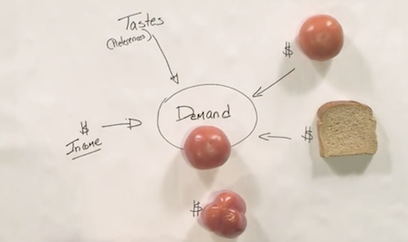
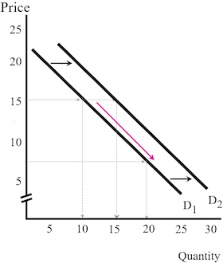
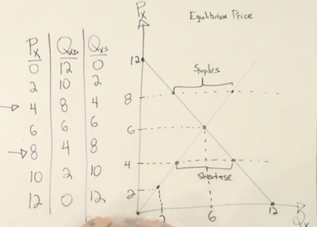
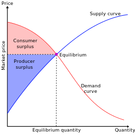
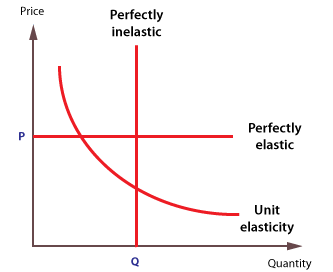
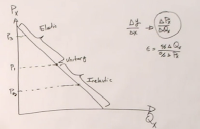
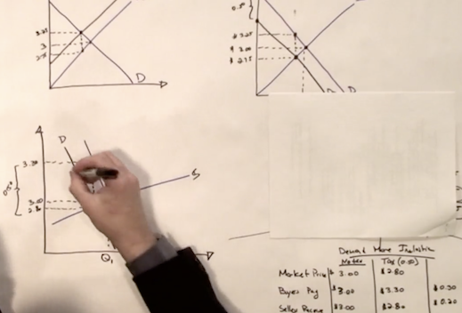

## 1. Basic Principes
经济学分布在生活的每一个角落，指导我们在面临多个选项时做出选择，合理分配有限的资源。这里的资源既可以是自然资源和社会资源，也可以是个人的时间、恋爱关系等。  
**Opportunity Costs**：机会成本指为了得到某一个东西放弃的其他选项中的最高价值者。比如晚上有一个免费但是不喜欢的演出A和一个愿意为之出50刀但实际票价只有40刀的演出B可以选择，那么选择看A的机会成本就是10刀（value-cost）。   
**Net Marginal Benefit Principe**：根据下一个行为产生的收益差（边际效益）而非总体收益做决策。比如传球比过人的成功率高，但是不能每次都选择传球。   
**the Invisible Hands Principe**：每个个体都出于自己利益最大化的考虑做决策，整个社会的收益也会最大化。比如想要减少汽油的使用，只要提高油价，大家就会选择买节能的车。   
**trade create value**：交易使人可以专注于最擅长的领域，从而提高了整体的生产效率。  
<!-- more -->  
## 2. Supply and Demand
市场的价格是由买卖双方共同决定的，就像是在一个酒吧里，搭讪成功的成本（打个招呼还是买杯饮料）是由男女比例决定的，男女恋爱关系的成本也同样适用。
### Demand
以西红柿为例，决定西红柿需求的因素大概有如下几个:  
- 西红柿本身的价格Px     
- 搭配商品的价格Px   
- 替代品的价格Py    
- 消费者的收入I  
- 消费者对西红柿的喜好程度T     

  
总结一下表示为：`Qx = f(Px,Py,I,T)`，其中本身的价格和搭配商品的价格都表示为Px。每个因素都可以看做独立的变量。当Px变化时，**quantity demanded**会沿着曲线变化，但demand并没有变化，demand只有在外界因素（比如收入I）发生变化时才会改变（平移）。  
   
供应量主要受商品价格和成本决定，可以通过相同的方式分析每个因素对供应量的影响。

### Equilibrium
当价格过高时会出现**supply surplus**，为了不让tomato都烂掉卖家会降价增加销量；当定价过低时会出现**supply shortage**，卖家会通过提高价格排除掉一部分买家增加收益。因此市场价格总是能够达到一种供需平衡的稳态，而这个稳态下的价格成为**equilibrium price**（或market clearing price）。       
   
### Using the model of Demand and Supply
1. 保持其它变量不变（ceteris parabus），搭配物品价格提高，搭配商品和本商品的需求降低，本商品的价格降低
1. 替代品价格降低，需求曲线左移，本商品需求减少，导致本商品价格降低
1. 生产成本提高，供应曲线上移，商品价格提高，供给量降低
1. 生产成本提高的同时用户偏好减弱，两个因素都会使quantity降低，但价格要取决于两个因素的强弱。

## 3.Market Efficiency and Government Policies
**Consumer Surplus**（消费者剩余）衡量了买者自己感觉到所获得的额外利益，剩余越大幸福感越强烈。`consumer surplus = willingness to pay(WTP)- price(P)`。 消费者剩余没有负数，当WTP小于P时交易不会发生。   
**Producer Surplus**（制造者剩余）指交易中实际获得的金额与其愿意接受的最小金额之间的差额，`producer surplus = P - WTS（cost）`  
  
当市场价格等于Equilibrium的时候社会整体的剩余最大，强行提高供给使得成本增加，生产者剩余减少（产生负数），消费者剩余增加（但增加量不及生产者剩余减少量）；强行降低供给使得生产者剩余和消费者剩余都减少。理论上，自由市场可以为社会带来最大的剩余。
### Government Intervention
当政府设置了**price ceiling**时（比较限价令），会造成供给短缺，这时供应方会提供劣质的产品，或者巧立名目得收取附加费用，而总会有消费者选择妥协，这造成了很多不必要的资源浪费。  
当政府设置了**price floor**时（比如最低工资线），会使企业减少招聘量，同时吸引更多的人应聘，因此会造成大量的失业。虽然就业的人收入比以前高了，但这个社会的生活水平却降低了。   
很多人愿意免费捐赠自己的肾，但是捐赠的人数远少于需要进行肾脏移植的患者数。所以如果一位母亲捐赠了自己的肾换取自己生病孩子的优先配对权，这样看起来好像没什么问题。如果用自己的肾换取孩子的学费呢？如果用自己的肾换取一辆车呢？放开器官的买卖限制无论对consumer还是producer来说都能获得更大的surplus，但是这也会带来很多伦理问题，只能通过鼓励更多人捐赠来解决这种矛盾（让供应曲线右移）。
## 4.Elasticity
**需求的价格弹性**指某一产品价格变动时，该种产品需求量相应变动的灵敏度。定义为：`Ex = %changeQ / %changeX`，一般情况下需求的价格弹性系数为负数，影响elasticity的因素：  
- 该商品有多少替代品，替代品越少，elasticity越低。生活必需品的弹性绝对值较小  
- 商品本身的价格，价格越低增量绝对值小，elasticity越低  
- 商品的耐用性，耐用的商品可以推迟购买，elasticity较低  
- 市场对价格的反应可能是迟缓的，时间越长弹性越大。例如：当汽油的价格上涨时，汽油的需求量只会在头几个月微幅减少。随着时间的增加，人们会买更省油的汽车、改搭大众运输工具、或搬到离上班地点较近的区域居住。在几年之内，汽油的需求量会明显减少。  

  
假设某个无弹性的商品价格一直往上涨，那么该商品必然会从无弹性变为有弹性。在此变化过程中，必然会经过一个点，在这个点上有一个**单位弹性 (elasticity of unitary)**。在这个点的上方曲线部分，是具有弹性的；在这个点的下方曲线部分，是不具备弹性的
   
**需求的收入弹性**衡量一种物品的需求对消费者收入变化的反应程度。  
+ 收入弹性为负的物品定义为劣质商品；收入弹性为正的物品定义为正常物品    
+ 0≤需求的收入弹性≤1，这类物品为必需物品；需求的收入弹性＞1，这类物品为奢侈物品    

**需求的交叉弹性**指某种其他物品的价格每变化1%，会使该物品的需求量变化百分之几。   
+ 当需求的交叉弹性是正值的时候，A和B均为对方的替代品(Substitute Goods)  
+ 当需求的交叉弹性是负值的时候，A和B均为对方的互补品(Complement Goods)  

**供应的价格弹性**表示价格变动引起供给量变动的程度。供给弹性的大小主要取决于以下两个因素：  
+ 生产时间的长短。生产时间较长的商品（比如房地产）供应弹性较小（inelastic）  
+ 增加产量所需追加生产要素费用的大小。增加产量的投资费用较小则供给弹性大   

在任何市场，无论是感情还是汽油市场，不愿离开市场的那一方承担大部分税款（对于异地恋来说是异地旅行费），这就是市场的弹性。  
   
没税时市场价是$3，当卖家承担0.5$的税后需求曲线左移市场价变为了2.75$，相当于买卖双方分别承担了$0.25的税；当卖家承担赋税时，供应曲线左移，依然是均摊税费。因此当供需双方的价格弹性相同时，是谁交税实际承担的比例是相同的。但实际上买家是更加inelastic的（需求曲线斜率更大），因此加税后的市场价可能是$2.8，买家实际承担了60%的税。**税收会降低整体的剩余，且对elastic商品（比如跑车）的影响更大**，

