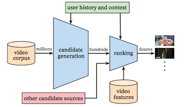
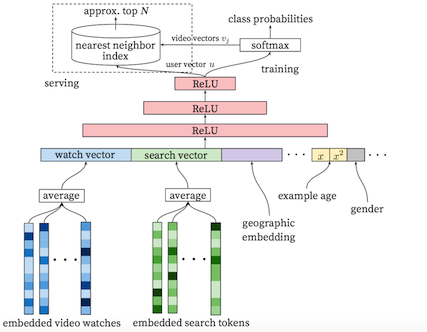
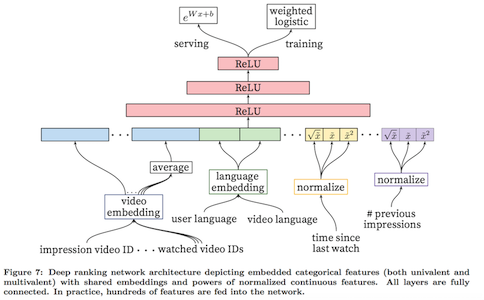
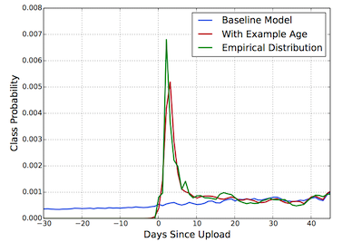

神经网络
Deep Learning over Multi-field Categorical Data ECIR2016

# Youtube DNN
YouTube视频推荐由两个神经网络组成，一个浅层的网络生成候选集，另一个深层的网络用于对第一个网络产出的列表进行精确排序。这种设计也允许融合起来来源召回的候选。  

## 候选生成
受词袋模型的启发，首先将用户不定长的历史行为映射到定长的embedding向量上，并且将用户和视频的一些特征也加入到输入层，这些高维的embedding特征和模型的其他参数一起学习。训练时将推荐看做一个多分类问题，使用历史数据作为样本最小化交叉熵损失，在线服务时通过对产出的向量进行最近邻搜索获取候选集(这种大规模的近邻查找是比较困难，YouTube使用了基于hash的近似搜索，Facebook之前的技术博客里提到了基于BallTree搜索，这两种方法都亲测过没有特别理想的加速效果，实现过程中应该还是有些未提及的trick)。

候选生成模型可以看作是矩阵分解的非线性实现。使用神经网络实现矩阵分解可以将任何的连续或者离散特征加入到模型中。

## 精确排序
排序模块融合了更多特征提供更加精确的预估，同时允许融合多个来源的候选进行统一排序。使用点击率作为优化目标会鼓励那些具有欺骗性但用户并不感兴趣的内容，因此观看时长是一个更好的衡量指标，因此使用了weighted logistic regression进行训练。

## 一些trick
### Example Age特征
机器学习模型往往对于历史偏好存在隐性的bias，而实际用户则更喜欢新鲜的内容，为了矫正视频随上传时间变化的流行度，将视频的上传时间作为训练的特征，而在预测时将这个值设为0来表示模型是在时间窗口的最尾端进行预测。   
   
通过这种方法很好的消除了这个implicit bias。

### 样本选择   
- 选择全网行为，而不仅仅是推荐系统的反馈，这样有利于发现用户的新兴趣
- 每个用户生产固定数量的样本，这样可以防止少数过于活跃的用户dominate整个模型
- 丢弃一些序列信息更有利于发现（当上下文切换时过于拟合之前的行为并不合适），防止过拟合。
- 不对称的共现对非常多（比如连续剧和特别流行的视频），因此采取“rollback”的方式采样预测下一个观看的视频比随机采样更好，可以防止未来信息的泄露。

### 特征表示
- 尽管深度学习有很好的特征表达能力，特征工程依然很重要，最大的挑战是如何表达用户的历史行为，以及这些历史行为与当前打分视频的关系。模型中最重要的特征也正是这些用户历史行为与当前视频的交叉关系，比如看过多少该频道的视频、最后一次观看该主题视频的时间等。
- 尽管有些特征的embedding是共享的，但仍要单独的放进输入层，以便上层网络学习。
- 神经网络对输入的scale和分布格外敏感，normalization有利于加速收敛速度。将连续值的多次项加入到特征中也能显著提高离线评估指标。

# Google Wide&Deep Learning
分类模型的预测能力可以分为Memorization和Generation两部分，Memorization可以通过对特征进行

[Recommending music on Spotify with deep learning](http://benanne.github.io/2014/08/05/spotify-cnns.html)
