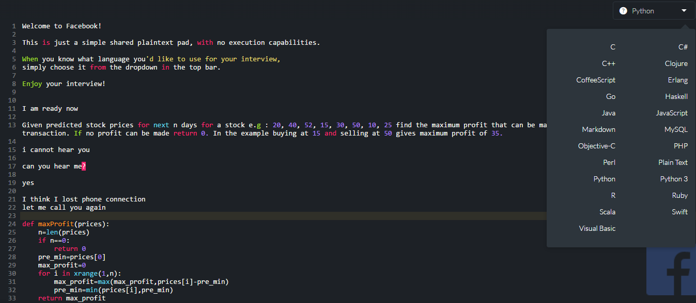
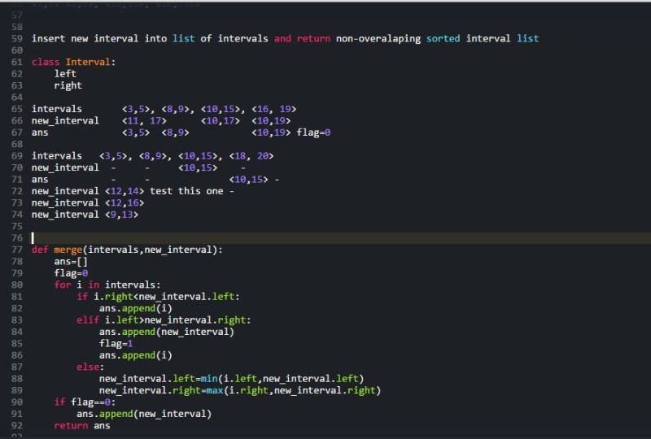

# Recruiter Interview
内推时特意注明了九月底会去美帝自由行，可以顺便onsite，大概不到一周的时间就接到了recruiter的电话。问了一下大概什么时间去美帝，然后跟我介绍了面试的流程，还给我发了一堆复习资料，主要是介绍公司业绩、文化和面试流程的。没有传说中的Behavior Interview，约了时间直接进入电话面试了。

# Screen Interview
电话面试约在美国时间周五下午，面试官是个口音很重的印度小哥，在Facebook开源的[coderpad.io](https://coderpad.io/)上进行，支持高亮和各种语言，比之前见过的Google Docs之类的好用多了。一分钟介绍后直接coding，中间还断了两次线，两道题25分钟做完，竟然没有准备第三题（据说是周五下午大家比较急着下班），然后聊了5分钟天就结束了。
 
- 第一题：直接贴了Leetcode股票交易问题，只能交易一次（如上图）。秒之，小哥问我是不是之前做过，鉴于我第一次做的时候也是秒之，我坚定的回答这是我第一次见。  
- 第二题：区间合并，也是Leetcode原题只不过这一次题目描述稍没有直接粘（可能是防止我cheat？）。本来也可以秒之的，但是吸取第一题的教训慢慢地写了出来，并且给自己埋了一个小bug然后fix掉了。如截图所示，需要运行面试官给出的case，并把中间状态展示出来（类似于onsite的白板），这样能够提高沟通效率（特别是在彼此都不怎么能听懂对方说话的情况下）
   

# On-site Interview
周五面完，下周二就给了回复说电面过了，但是因为签证问题卡住了一段时间，我给的回复也很坚定：先把面试流程走完再考虑后续可能存在的问题，反正我是顺路去的对大家来说成本都不大。后来他就同意了，并且给我安排了面试时间及酒店。面试前会提供所有面试官的信息，所以可以LinkedIn上搜一下背景熟悉一下。9月30号早上九点来到了Menlo Park的办公区，新租的车倒车系统不太会用，刚到园区就在停车场顶了一辆车，带着复杂的情绪进入了面试间（一块白板两个沙发，全天都会在这里）。
## 1. Coding
面试官是Instagram某个组的manager（台湾人，2004年ICPC亚洲区金牌）加一个中国小哥shadow（做前端开发的）。  
- 第一题：经典的字符串匹配。告诉我不用实现KMP，但我还是不死心拿着两个指针在那搞，加上刚开始有点紧张一直都有bug，浪费了十多分钟。后来调整了一下心态，把之前的擦掉直接写了一个O(n*n)的暴力解法，告诉我不用继续优化了这样就行。  
- 第二题：给出若干区间，求重叠次数最多的一个点。首先证明某个端点一定是重叠最多的点，然后按照区间左端点排序，保存右端点，遍历每个区间，看当前有多少个大于等于该左端点。用了python的bisect，解释了一些函数的用法。（虽然我觉着这个解法有点bug但还是过了）  
- 第三题：给出字符串a和b，求b中出现了a中所有字符的最小substring。拿个map存下字符串a中每个字符出现的频率，然后用two pointer扫描字符串b。Leetcode原题，bug free。  

本以为第一题浪费了那么多时间要跪了，没想到三道题下来只用了35分钟，然后跟manager聊了以下他日常的工作，见一直把中国小哥晾着大家都比较尴尬就跟他聊了一下React。

## 2. Machine Learning
Feed排序部门的白人manager面，印度小哥shadow。寒暄之后问为什么线上效果跟线下实验不一致。大概回答了这么几点：目标函数和线上指标不一致、过拟合、样本空间突变、有bug等等。然后问了我常用的模型，LR和GBDT中哪些参数可以控制过拟合。
接下来大部分时间在聊设计个性化实时热门词排行榜的项目，以点击率为优化目标，主要是如何设计特征上聊了很多，他们对我的特征编码方式不是很理解，纠结了好一会；模型就简单说了一下为什么选FTRL不选其他的也没多问。最后QA环节聊了一下Facebook几年前发表的GBDT+LR做特征组合的paper和深度学习进展，这个环节比前面正经的面试丝滑多了，意犹未尽。 

## Lunch Break
广告部门的中国小哥带着吃了个仓促的午餐，终于可以说中文了，聊了一下这边的生活和工作。然后去买了点纪念品吃了个很好吃的免费冰激凌，回去时面试官已经在门口候着了(匆忙扔掉了没吃完的免费冰激凌，尴尬)，然后带着我去上了个厕所（虽然我知道位置，但是按规定到任何一个角落都要有人跟着）。

## 3. Coding
亚裔面孔，搞不清是中国人还是韩国人还是台湾人，整体感觉很严谨，目测是个scientist。
- 第一题：最长上升子序列加了应用情景（打靶），很容易抽象回去。我怕直接上显得之前做过就先来了个O(n*n)的土鳖做法，然后心有成竹地升级成了二分查找的O(nlogn)解法，没想到居然让我证明单调性，然后又是好一顿解释。这么简单的题浪费了大约25分钟
- 第二题：一个数据流，两种操作：一个数字进入流；随机返回一个数字。这题Leetcode上见过但是当时没做，瞬间有点慌，但是这个面试官的引导还是不错的，在他的引导下一步步找到了答案，中间还推到了条件概率。 

这一面比较仓促，连最后的QA环节都没有。目测面试官的反馈不是太正向，但是面试官人和和善很善于引导，整个过程比较流畅，所以感觉时间过得很快。

## Recruiter Talk
中间休息二十分钟，一起去喝了杯咖啡。简单聊了一下前几轮的感受，还问我还会不会再来美帝，可能有加面。也没有behavior Interview，就简单聊了一下这次旅行的行程，以及讨论把人家车撞了该如何处理。。。我的recruiter是个天天笑嘻嘻的拉美人，给人的感觉很nice。

## 4. System Design
本来是个华人manager面的，结果回家看孩子了（貌似是一种福利，Recruiter还跟我炫耀说你看咱家福利多好）让手下一个强制的印度小哥来面了，顿时心里一万只草泥马飞奔而过。不过问的问题都比较简单，设计feed点赞数统计和推送，大概框架是搞个load balancer分布式处理，然后维护关注列表feed2user进行推送。
- 热门feed问题：每个user和feed都维护一个队列，在累积了一定的时间窗口后进行同步和推送；数据库分块和缓存。
- 网络延时问题：各大洲分别设置服务器，服务器之间通信后同步给各洲的用户
- 网络一致性问题：类似于网络三次握手协议

他的口音比较重具体说了些啥我也听不懂，靠大体理解维持了15分钟闲聊（数据库、缓存、图存储、团队协作啥的都大概扯了一点），期间一直期待下个面试官早点来。。。

## 5. Manager Talk
然后他真的来的，但依然是个印度哥哥，看LinkedIn上写的职位是Research Scientist，但是问的问题都很实际。
+ 让我自己挑一个简历上的项目讲
+ 问了几个团队协作的问题，如何跟partner合作，如何向老板争取资源，意见不同意时如何说服他
+ 最后写了coding，似的小于x的数排在前面，x到y之间的排中间，大于y的排最后。我用了双指针扫描，解释了好一会。然后他非常惊讶的说：别人都是重建个数组然后扫描三次，你这个做法真有趣。(卧槽，原来可以这么简单啊，我又把他们想复杂了,一万只草泥马。。。)

<!-- [How to Ace a Data Science Interview](https://alyaabbott.wordpress.com/2014/10/01/how-to-ace-a-data-science-interview/)
[a nice intuitive overview about ML](https://shapeofdata.wordpress.com/introduction/)
[AI and Machine Learning Interview Questions](http://popsnip.com/topic/994/ai-and-machine-learning-interview-questions) -->