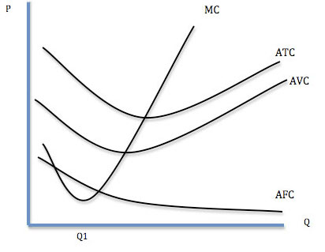
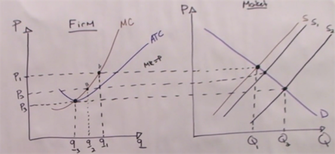
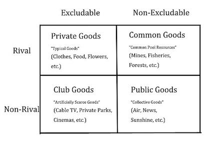
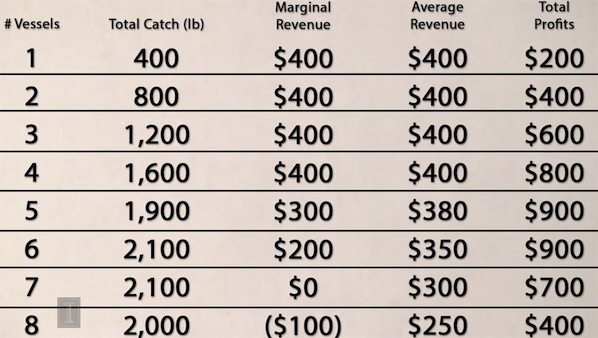

## 1. Basic Principes
经济学分布在生活的每一个角落，指导我们在面临多个选项时做出选择，合理分配有限的资源。这里的资源既可以是自然资源和社会资源，也可以是个人的时间、恋爱关系等。微观经济学里最重要的几个原则：  
**Opportunity Costs**：机会成本指为了得到某一个东西放弃的其他选项中的最高价值者。比如晚上有一个免费但是不喜欢的演出A和一个愿意为之出50刀但实际票价只有40刀的演出B可以选择，那么选择看A的机会成本就是10刀（value-cost）。    
**Net Marginal Benefit Principe**：根据下一个行为产生的收益差（边际效益）而非总体收益做决策。比如传球比过人的成功率高，但是不能每次都选择传球。     
**the Invisible Hands Principe**：每个个体都出于自己利益最大化的考虑做决策，整个社会的收益也会最大化。比如想要减少汽油的使用，只要提高油价，大家就会选择买节能的车。  
**trade create value**：交易使人可以专注于最擅长的领域，从而提高了整体的生产效率。  
<!-- more -->  
## 2.Supply and Demand
市场的价格是由买卖双方共同决定的，就像是在一个酒吧里，搭讪成功的成本（打个招呼还是买杯饮料）是由男女比例决定的，男女恋爱关系的成本也同样适用。
### Demand
以西红柿为例，决定西红柿需求的因素大概有如下几个:  
- 西红柿本身的价格Px     
- 搭配商品的价格Px   
- 替代品的价格Py    
- 消费者的收入I  
- 消费者对西红柿的喜好程度T     

  
总结一下表示为：`Qx = f(Px,Py,I,T)`，其中本身的价格和搭配商品的价格都表示为Px。每个因素都可以看做独立的变量。当Px变化时，**quantity demanded**会沿着曲线变化，但demand并没有变化，demand只有在外界因素（比如收入I）发生变化时才会改变（平移）。  
   
供应量主要受商品价格和成本决定，可以通过相同的方式分析每个因素对供应量的影响。

### Equilibrium
当价格过高时会出现**supply surplus**，为了不让tomato都烂掉卖家会降价增加销量；当定价过低时会出现**supply shortage**，卖家会通过提高价格排除掉一部分买家增加收益。因此市场价格总是能够达到一种供需平衡的稳态，而这个稳态下的价格成为**equilibrium price**（或market clearing price）。       
   
### Using the model of Demand and Supply
1. 保持其它变量不变（ceteris parabus），搭配物品价格提高，搭配商品和本商品的需求降低，本商品的价格降低
1. 替代品价格降低，需求曲线左移，本商品需求减少，导致本商品价格降低
1. 生产成本提高，供应曲线上移，商品价格提高，供给量降低
1. 生产成本提高的同时用户偏好减弱，两个因素都会使quantity降低，但价格要取决于两个因素的强弱。

## 3.Market Efficiency and Government Policies
**Consumer Surplus**（消费者剩余）衡量了买者自己感觉到所获得的额外利益，剩余越大幸福感越强烈。`consumer surplus = willingness to pay(WTP)- price(P)`。 消费者剩余没有负数，当WTP小于P时交易不会发生。   
**Producer Surplus**（制造者剩余）指交易中实际获得的金额与其愿意接受的最小金额之间的差额，`producer surplus = P - WTS（cost）`  
  
当市场价格等于Equilibrium的时候社会整体的剩余最大，强行提高供给使得成本增加，生产者剩余减少（产生负数），消费者剩余增加（但增加量不及生产者剩余减少量）；强行降低供给使得生产者剩余和消费者剩余都减少。理论上，自由市场可以为社会带来最大的剩余。
### Government Intervention
当政府设置了**price ceiling**时（比较限价令），会造成供给短缺，这时供应方会提供劣质的产品，或者巧立名目得收取附加费用，而总会有消费者选择妥协，这造成了很多不必要的资源浪费。  
当政府设置了**price floor**时（比如最低工资线），会使企业减少招聘量，同时吸引更多的人应聘，因此会造成大量的失业。虽然就业的人收入比以前高了，但这个社会的生活水平却降低了。   
很多人愿意免费捐赠自己的肾，但是捐赠的人数远少于需要进行肾脏移植的患者数。所以如果一位母亲捐赠了自己的肾换取自己生病孩子的优先配对权，这样看起来好像没什么问题。如果用自己的肾换取孩子的学费呢？如果用自己的肾换取一辆车呢？放开器官的买卖限制无论对consumer还是producer来说都能获得更大的surplus，但是这也会带来很多伦理问题，只能通过鼓励更多人捐赠来解决这种矛盾（让供应曲线右移）。
## 4.Elasticity
**需求的价格弹性**指某一产品价格变动时，该种产品需求量相应变动的灵敏度。定义为：`Ex = %changeQ / %changeX`，一般情况下需求的价格弹性系数为负数，影响elasticity的因素：  
- 该商品有多少替代品，替代品越少，elasticity越低。生活必需品的弹性绝对值较小  
- 商品本身的价格，价格越低增量绝对值小，elasticity越低  
- 商品的耐用性，耐用的商品可以推迟购买，elasticity较低  
- 市场对价格的反应可能是迟缓的，时间越长弹性越大。例如：当汽油的价格上涨时，汽油的需求量只会在头几个月微幅减少。随着时间的增加，人们会买更省油的汽车、改搭大众运输工具、或搬到离上班地点较近的区域居住。在几年之内，汽油的需求量会明显减少。  

  
假设某个无弹性的商品价格一直往上涨，那么该商品必然会从无弹性变为有弹性。在此变化过程中，必然会经过一个点，在这个点上有一个**单位弹性 (elasticity of unitary)**。在这个点的上方曲线部分，是具有弹性的；在这个点的下方曲线部分，是不具备弹性的
   
**需求的收入弹性**衡量一种物品的需求对消费者收入变化的反应程度。  
+ 收入弹性为负的物品定义为劣质商品；收入弹性为正的物品定义为正常物品    
+ 0≤需求的收入弹性≤1，这类物品为必需物品；需求的收入弹性＞1，这类物品为奢侈物品    

**需求的交叉弹性**指某种其他物品的价格每变化1%，会使该物品的需求量变化百分之几。   
+ 当需求的交叉弹性是正值的时候，A和B均为对方的替代品(Substitute Goods)  
+ 当需求的交叉弹性是负值的时候，A和B均为对方的互补品(Complement Goods)  

**供应的价格弹性**表示价格变动引起供给量变动的程度。供给弹性的大小主要取决于以下两个因素：  
+ 生产时间的长短。生产时间较长的商品（比如房地产）供应弹性较小（inelastic）  
+ 增加产量所需追加生产要素费用的大小。增加产量的投资费用较小则供给弹性大   

在任何市场，无论是感情还是汽油市场，不愿离开市场的那一方承担大部分税款（对于异地恋来说是异地旅行费），这就是市场的弹性。  
   
没税时市场价是$3，当卖家承担0.5$的税后需求曲线左移市场价变为了2.75$，相当于买卖双方分别承担了$0.25的税；当卖家承担赋税时，供应曲线左移，依然是均摊税费。因此当供需双方的价格弹性相同时，是谁交税实际承担的比例是相同的。但实际上买家是更加inelastic的（需求曲线斜率更大），因此加税后的市场价可能是$2.8，买家实际承担了60%的税。**税收会降低整体的剩余，且对elastic商品（比如跑车）的影响更大**，

## 5.Production
**dismissing marginal return**（边际收益递减规律）：在短期生产中（长期可以改变固定成本），保持其它条件不变增加单一变量投入可以增加产量，但增长速度会逐渐变慢。原因在于固定投入对于承担可变投入的能力存在限度。  
生产成本分为（短期内）固定成本Fixed Cost（比如房租）和可变成本Variable Cost（比如工人），单位产量的总成本`ATC=AFC+AVC`。**边际成本**指每一单位新增产品带来的总成本的增量（总成本的斜率）。
  
随着产量的增加。成本曲线ATC先下降后上升的“U型”，AMC曲线和ATC曲线的交点也是ATC的最低点。水电、电信等公共事业行业容易形成垄断，因为固定成本较高。

## 6.Competitive Output
贪婪是市场经济的驱动力，这里我们假设所以的企业都是贪婪的，即maximize profits。**economic profit**（经济利润）的成本包括显性成本（直接投入）和隐性成本（机会成本）两部分，而accounting profit不考虑机会成本。下面提到的利润均指经济利润。     
如果市场中的买者和卖者规模足够大，不存在价格制定者，那么这种市场成为**perfect competition**（完全竞争）市场，卖家可以随时进入或退出。而在某些市场领域里，某产品的竞争并不激烈，卖家能够对该产品的价格进行控制，那么他们是价格制定者。  
### 短期决策
当如果价格小于平均可变成本（P < AVC）时停产，否则有多余的利润支付固定成本，继续营业。这个规则适用于短期决策，因为长期决策中没有固定成本。
### 长期决策
对于完全竞争市场而言，当有新的竞争者进入时，价格不断下降直至P=AVC。此时，不会有新的竞争者加入该市场，达到一个长期均衡状态。在完全竞争市场中，企业之间的竞争主要集中在成本上，生存下来的都是效率最高的企业。

当需求增加价格提高后，平衡会重新被打破，吸引更多的竞争者加入，直至达到新的平衡状态。   
以上所讲的情况假设随着竞争规模增加成本不变，这种行业称为constant-cost industry。而有些行业资源有限，比如石油，开采量越大开采难度越大成本越高，这种成本随竞争者数量增加而增加的行业称为increasing-cost industry。还有一些行业，由于更多的供应商参与研发促进了技术的进步从而减少了成本，比如汽车和电脑，称为decreasing-cost industry。
## 7.Firms with Market Power
根据供应商数量和商品的区分度，可以将市场分为三种不同的类型：  
- **monopoly**垄断行业，比如水电通信供应商；   
- **oligopoly**寡头行业，比如航空公司、石油供应商；  
- **monopolistic competition**垄断性竞争，比如食品衣服电器等。  
### Sources of Market Power
资源的垄断、政府的许可（比如专利）、领先的技术以及广告（就是让消费者产生一种这种商品有别于其它商品的特殊性）都会让卖家有控制价格的能力。但这些因素都是相当短期的，更持久的**natural monopolies**：为了获取利益最大化，自然垄断的企业即使被人为拆分后的企业还是会重组，使得垄断企业死而复生。
### Price Discrimination
对于同样的产品，根据不同市场上的需求价格弹性不同，实施不同的价格，这种定价策略叫**Price Discrimination**。比如提供议价空间；学校根据家庭收入情况颁发教学金；学生票和老年票，冷门时段的折扣或者优惠券等，都是价格歧视的例子。  
有足够的市场能量、防止低价买入高价卖出的倒卖者、和区分不同需求弹性的用户是价格歧视的前提条件。对于航空公司而言，商务人士的需求弹性较小，愿意支付更高的费用；而旅行者行程比较灵活，需求弹性较高。航空公司一般通过两种方法区分：购票时间离起飞时间越短，说明需求越inelastic；周六之前返程的更可能是商务人士。   
**bundling**和**Two-part Tariff**都可以认为是价格歧视的执行方式。捆绑销售利用的是不同消费者对不同商品定价的不对称性。两部收费指先向消费者收取一定数量的固定费用，然后再按消费数量向消费者收取使用费。

价格歧视是满足帕累托标准的，通过价格歧视，卖方获取的最大收益，等于社会福利最大化的值。如果垄断的卖方实行统一价格，虽然也能达到一个最大的收益，但却小于社会福利最大化的值，因而在经济上是无效率的。

## 8.Public Goods, Common Resources, and Externalities

根据商品的**rivalry**（对该物品的消费是否影响到其它人对该物品的消费）和**excludability**(能够阻止他人使用或消费这个物品),可以把商品分为Public Goods（公共物品，比如国防）、Common Goods（共有财产，比如空气、公园）、Club Goods（集团财产，比如网上的付费电影、卫星信号）和Private Goods（私有财产，如衣服、食物）
   
有些物品严格属于某个分类，而有些物品是同时属于多个分类的。市场对私有物品的分配是有效的，而面对其他物品是会出现market failure。

### Public Goods 
对于公共资源，不做任何贡献的人可能比做出贡献的人获得的收益更多。比如说国防，让国家的每个人都是受益，但是没有动力让受益的每个人给国防做什么贡献。因此就存在了很多搭便车的free rider，影响对公共资源的有效分配。
因此电视台（或者搜索引擎）采取放广告的方式，政府采取纳税的方式，让用户在享受免费服务的同时付出贡献。但是公共资源的价值无法衡量，比如国防和交通信号灯（一条人命值多少钱），因为不能完全交给市场调控。
### Common Resources
公共资源同样存在这种悖论。比如每条船出海的成本是200，如果所有的船都归一个公司所有，那么6条船出海时收益最大；如果第7条船归个人所有，那么他仍会选择出海（有利可图），但是整体的收益会降低。
   
公共资源的问题在于没有财产权。如上面的例子，如果所有出海的船只属于一个人或一家公司，那么公共资源的利用率则能够得到最大化，并且公共资源也能得到很好的保护。政府的限制令和收取的开采费用同样能够达到类似的效果。
### Externalities
外部条件的发生需要具备两个条件：   
- 要有一方的活动对另一方的福利造成了影响，比如电力公司对水造成了污染，影响了居民。     
- 对另一方的福利造成了损失却没有给予补偿，比如吸烟者影响了不吸烟者。     
电力造成水污染，其价格是没有计算社会成本在内的。这些社会成本就是外部条件，如果要加上这些社会成本，那么电力总成本上升，供给曲线左移，供电量减少、价格上升。相当于还是由消费者承担这部分成本。  
以上外部条件都是负向的，也有一些正向的外部条件，比如自己打了疫苗别人得病的概率也会降低，自己装修了房子周围的房价也会上升，但是并没有得到补偿。

根据**Coase Theory**：只要把产权界定清楚，总会通过协商找到合理的分配方式。。但有时并不科学，因为交互成本可能是巨大的（不可能将全国人民拉到一起协商），这是需要政府干涉。比如通过税收或者限制排放量（公司之间可以买卖排放量指标）来减少企业的污染排放（污染小的企业会胜出，从而提高生产效率）。

## 观后感
这门课的评分很高，典型的西式课堂，老师围绕着学校周围的各种现象作为例子，同时在课堂上进行了很多小游戏帮助学生理解。概念比较基础，不太费脑，适合用来“放松”。同时能够培养一些经济学的思维方式（通过供需关系的变化解释各种经济现象），上完课看看知乎讨论之类的，interesting。

