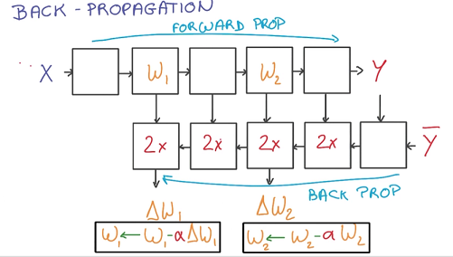

Udacity和Google合作开设的一门deep learning入门课 [课程链接](https://classroom.udacity.com/courses/ud730)，由Google首席研发科学家Vincent Vanhoucke主讲，以实战的视角介绍了常用deep learning算法，原理性的内容大多一两句话带过没有详细的证明推导，但也算句句珠玑了，wide but not very deep。作业使用修改过的MNIST(手写数字识别)数据集，python编程，在scikit-learn和TensorFlow平台上完成，可以借此熟悉平台使用。主要内容包括机器学习基本概念、深度神经网络、卷积神经网络、文本和序列的深度模型。
  
<!-- more -->
## 1. From Machine Learning to Deep Learning
讲了softmax、one-hot encoding、cross entropy、learning rate、overfitting、gradient decent、测试集划分、评估指标等基本概念。
## 2. Deep Neural Networks
线性模型具有很多优点，比如较高的稳定性，输入的细小变更不会对输出造成剧烈的波动，且求导和计算较为方便。但是线性模型有太多的参数需要学习，且不能拟合非线性数据。因此我们需要引入非线性模型。
### 2.1 Activation Function 
sigmoid和tanh传统神经网络中最常用的两个激活函数，但这两个激活函数都存在梯度饱和问题（**Vanishing Gradient Problem**）：函数的梯度接近于两端时计算出的梯度接近于0，引起参数弥散问题，传到前几层的梯度也非常靠近0，导致参数更新变慢。
 
相比sigmoid和tanh函数，Relu激活函数（The Rectified Linear Unit）的优点在于：
- 梯度不饱和：在反向传播过程中，减轻了梯度弥散的问题，神经网络前几层的参数也可以很快的更新。
- 计算速度快：sigmoid和tanh函数计算激活值时需要计算指数，而ReLU函数仅需要设置阈值，加快了正向传播的计算速度。
- 稀疏激活性：人脑神经元编码工作方式具有稀疏性和分布性，同时被激活的神经元只有1~4%。而在ML中，稀疏特征有更大可能线性可分，可以产生更好的鲁棒性。ReLU函数对负值特征进行了裁剪，产生了更好的稀疏性。 

根据[AlexNet的论文](http://www.cs.toronto.edu/~hinton/absps/imagenet.pdf)，与普通的Sigmoid系函数对比，使用ReLU的收敛速度可以加快6倍。同时由于引入了稀疏性在效果上也有一定程度的提高。但是需要设置一个合适的较小的learning rate，否则会导致[dying ReLU问题](http://datascience.stackexchange.com/questions/5706/what-is-the-dying-relu-problem-in-neural-networks)
### 2.2 Neural Networks 
Neural Networks通过激活函数对线性模型做非线性组合，将一个线性模型的输出转化为下一个线性模型的输入，使其能够解决非线性问题。
 
根据求导的Chain Rule,可以使用Back Propagation计算每个函数的梯度并进行更新：正向计算loss，逆向计算梯度。
 
相比于前向传播，反向求导的每一步都将花费两倍的运算和存储空间。
### 2.3 Training a Deep Neural Networks
有两种方法可以使Neural Networks变得更加复杂：一种是增加隐层中的单元数（wider），另一种是增加隐层的层数（deeper）。单纯的增加隐层的节点数并不能有效提高模型的效果，深度的模型具有更好的效果：
- wider模型包含了过多的参数，会降低学习的效率
- deeper能够更好捕捉数据的结构，比如图片识别中底层的能够识别线和边，中间层可以识别几何形状，深层可以识别人脸等物体   

在神经网络中，除了使用L1、L2等常用的惩罚项方式overfitting外，一种特有的方法**DropOut**：每次只是用部分节点做计算和更新，由于数据缺失被迫学习冗余的表达，但是却使模型具有了更好的健壮性和表达能力。也可以从ensemble learning的角度解释DropOut，类似于bagging的方法，每次mini-batch都学一个不同的网络结构，最终预测时则使用子网络的集合进行互补。

## 3. Convolutional Neural Network
### 3.1 Translation Invariance
图片中的物体或者文章中的词，无论出现在什么位置所代表的含义都应该是一样的，这种预测不随时间和空间变化的能力称为translation invariance(平移不变性)。在神经网络中通过weight sharing来实现translation invariance，即对于相同的物体的不同样本进行joint train并共享彼此的权重。在图像领域一般通过convolutional network来实现不同空间的参数共享， 而在文本处理领域则通过embedding和recurrent neutral network来实现不同时间的参数共享。

### 3.2 Convolutional Network
图像的一部分的统计特性与其他部分是一样的，这也意味着我们在这一部分学习的特征也能用在另一部分上，所以对于这个图像上的所有位置，我们都能使用同样的学习特征，卷积神经网络通过卷积特征实现了weight sharing。卷积抽取即将一个大尺寸的图片切分成若干形状相同的小区块（Patch），像是一个刷子刷过整个区间，每个小区块都对应若干维度的特征。
 
由于移动步长（stride）不一定能整除整张图的像素宽度，不越过边缘取样成为Valid Padding；越过边缘取样成为Same Padding，超出部分的矩阵补零。
这种方式对原始图像做平移不变性的编码，通过步长实现了图像数据的downsampling，使用共享权重的卷积核减少了参数的数量。在卷积网络中，通过卷积逐步挤压空间的维度，同时不断增加深度，使深层信息基本上可以表示出复杂的语义，最终将一个deep and narrow的feature层作为输入传给神经网络进行学习。
 

### 3.3 Optimization
#### Pooling
为了描述大的图像，一个很自然的想法就是对不同位置的特征进行聚合统计，例如可以计算图像一个区域上的某个特定特征的平均值 。这些概要统计特征不仅具有低得多的维度 (相比使用所有提取得到的特征)，同时还会改善结果(不容易过拟合)。这种聚合的操作就叫做池化 (pooling),常用的池化方法有最大值池化和平均值池化（相当于降低分辨率）。常用的做法是将池化层和卷基层交替出现，最后进行全连接。
 
#### 1x1 Convolution 
在一个卷积层的输出层上，加一个1x1的卷积层，这样就形成了一个小型的神经网络，达到了降维和特征转换的作用。通常与Max pooling一起使用。
  
left: Convolution with kernel of size 3x3; right: Convolution with kernel of size 1x1
#### Inception 
在网络的每一层我们都要选择使用卷积还是pooling以及他们的形状，每一种结构都会对效果产生正向效果为什么要choose呢，let’s use them all. 于是在GoogLeNet中提出了Inception module：对同一个卷积层输出执行各种二次计算，用了Inception之后整个网络结构的宽度和深度都可扩大，既能达到稀疏的减少参数的效果，又能利用硬件中密集矩阵优化计算效率，同时利用了NIN结构中非线性变换的强大表达能力。
  

## 4. Deep Models for Text and Sequence
文本中有很多单词是我们从未见过或者很少出现的，但这部分单词（比如药名等专业术语）往往具有重要的含义，这种稀疏性给模型训练带来了很大的困难。另外我们常用不同的单词描述相同的事物，比如cat和kitty，对于这些词我们希望他们可以share weight。这两个问题都可以使用无监督学习解决，基于的假设是：**相似的词会出现在相似的场景中，词的含义由上下文决定**。

### 4.1 Embedding(word2vec)
Embedding将单词映射到一个向量，越相似的单词的向量会越接近。word2vec通过单词的context（邻居）进行训练得到向量表示，最终使用Logistics Regression进行预测，非常简单高效。

word2vec有两种架构：CBOW是根据context来预测word概率P(word|context)；而skip-gram是根据word来预测context的概率P(context|word)。这也就导致了Skip-gram更慢一些，但是对低频词效果更好；对应的CBOW则速度更快一些。skip-gram的窗口大小一般10左右， CBOW一般取5左右。

优化方法则有基于霍夫曼树逐个节点softmax的Hierarchical Softmax和负采样方法。层次 softmax对低频词效果更好，而负采样对高频词效果更好。
word2vec的优点：
+ 在不丢失信息的情况下降低维度
+ 矩阵及向量运算便于并行
+ 类比(线性规则): 对单词的向量进行加减法运算，可以得到语义加减，例如：`taller`-`tall`+`short`=`shorter`, `France`-`Paris`+`Italy`=`Rome`。便于推到和扩展
+ 可比较: 两个单词之间相似度一般通过的向量夹角大小来判断，用cosin值而非L2计算。
+ 可视化: `t-SNE`是一种降维的方法，可以在保留邻居关系的情况下将词向量从高维空间投影到二维空间下查看相似度。  

### 4.2 RNN
文本是一个长度可变的序列，因此不能直接表示为vector了。RNN每一轮迭代都根据过去的数据判断当前的状态，这就需要一个非常深的网络记忆之前所有分类器的状态。而使用Recurrent Connection对过去的状态进行总结并传递状态，这样就简化了网络的结构。

在通过BackPropagation进行参数学习时，对应同一个参数会有很多次求导和更新，使用SGD就存在很大的问题了，因为SGD是通过不相关的求导更新参数已达到训练的稳定性。由于梯度之间的相关性会出现exploding gradient（梯度急剧下降）和vanishing gradient（梯度几乎为0）的问题。exploding gradient可以使用gradient clipping修复，即当梯度大于某个阈值的时候进行截断。

### 4.3 LSTM
vanishing gradient会导致分类器只对最近状态的有反应，丧失学习到连接如此远的信息的能力，于是就产生了LSTM(Long Short-Term Memory)。一个RNN的model包含两个输入：过去状态和新的数据，两个输出：当前的预测和将来状态，中间是一个简单的神经网络。而把中间的部分换成LSTM-cell，就可以解决vanishing gradient问题，提高RNN的记忆能力。
一个简单的记忆模型包含写、读、遗忘三个步骤。每一步不单纯做01判断，而是使用一个连续值决定对输入的接收程度，这样就可以进行求导和训练了。
  
最后用一个逻辑回归训练这些连续的参数，输出时进行归一化。这样就可以方便地训练并且消除了gradient vanishing的问题，让整个cell更好地平衡记忆和遗忘。对于LSTM而言，L2和用于输入输出数据的Dropout（不可用于Recurrent Connection）都是可以奏效的RRegularization方法。

生产序列是一个不断重复预测、采样、预测的过程，每次只预测一个结果是比较贪心的，多预测几部然后选择概率最高的那个会提高效果，但是生成的候选集会指数增长，通过beam search进行剪枝可以有效控制候选集合并取到很好的效果。
 

## 观后感
虽然整个课程的视频只有一个多小时的样子，但是要把所有内容都消化还是要花很多时间到处查资料的。DL博大精深，但是TensorFlow这些神器也一定程度上降低了学习成本，这个课本身也是实践导向，提倡暂时忽略一些背后的复杂推导做个lazy engineer，然后learn by practice。视频已撸完，对应的知识也大体理解了，接下来该装个TensorFlow把课上的assignment跑起来了。

## 参考
- [UFLDL教程](http://ufldl.stanford.edu/wiki/index.php/UFLDL%E6%95%99%E7%A8%8B)
- [ReLu(Rectified Linear Units)激活函数](http://www.cnblogs.com/neopenx/p/4453161.html)
- [Inception in CNN](http://blog.csdn.net/stdcoutzyx/article/details/51052847)
- [Understanding LSTM Networks](http://colah.github.io/posts/2015-08-Understanding-LSTMs/) [中文翻译](https://github.com/ahangchen/GDLnotes/blob/master/note/lesson-4/unstand_lstm.md)
- [别人家的课程笔记1](https://github.com/ahangchen/GDLnotes) [别人家的课程笔记2](http://blog.csdn.net/somtian/article/details/53152206)
