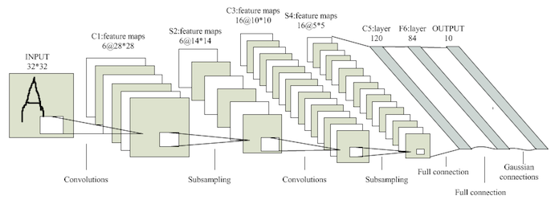
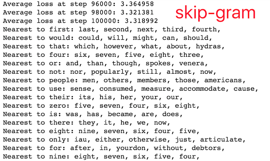
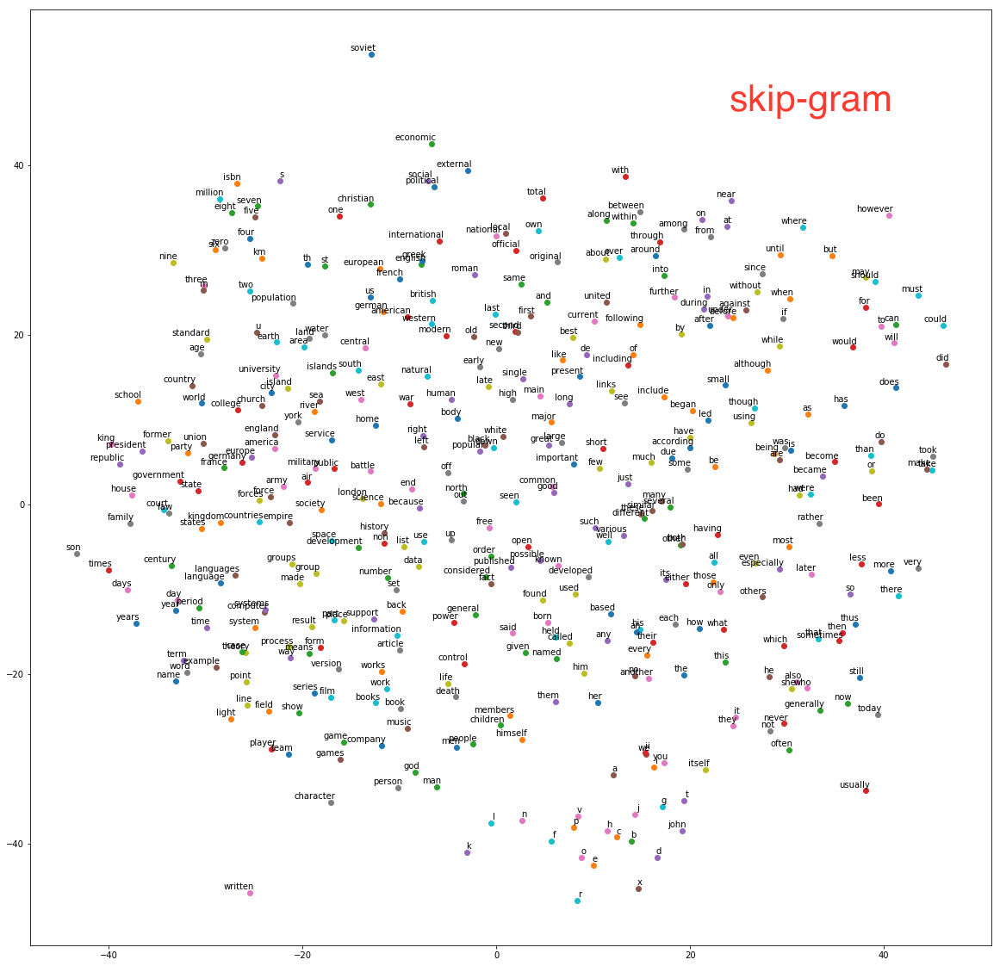
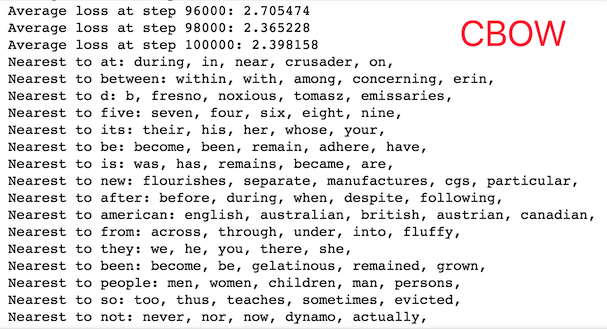
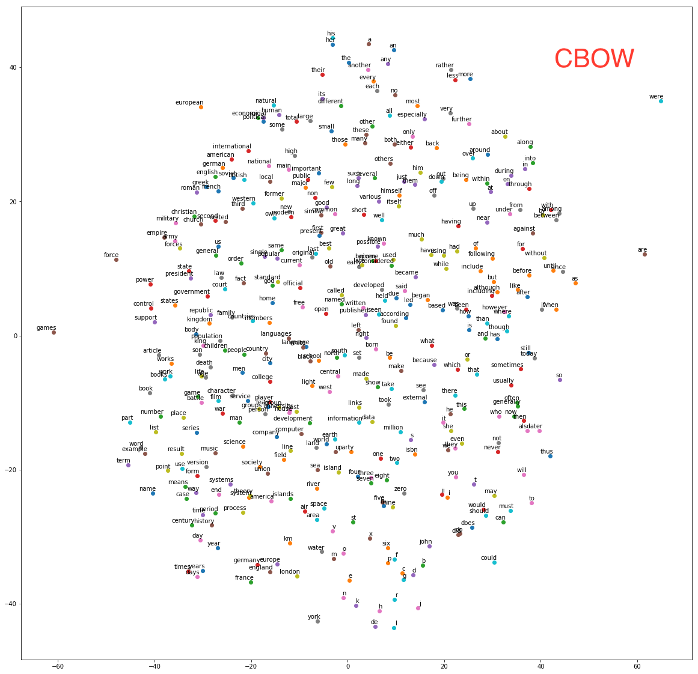

deep learning入门公开课 [课程链接](https://classroom.udacity.com/courses/ud730)的课堂作业，类似于TensorFlow的教学实践，总共分为三部分：首先是环境的搭建及TensorFlow的基本介绍；其次是手写字母识别（比手写数字识别数据集MNIST要困难一点），前后使用了线性模型、NN、DNN、CNN模型。最后两个任务是在维基百科数据集上做词向量表示和序列学习，分别使用了word2vec和LSTM算法。TensorFlow是个通用性很高的框架，通过图的形式定义网络结构及运算流程非常清晰易懂，提供的算子也越来越丰富，感谢前人造的轮子。   
这里简单记录下完成作业过程中遇到的一些问题，前期还是比较坎坷的，后面就比较通畅了，详细代码存放在我的[Github项目](https://github.com/sensirly/udacity-deep-learning-assignment)中。  
<!-- more -->

## 0.环境搭建
1. 安装Homebrew、python、pip、docker、jupyter notebook
1. 尝试了docker和pip两种方式安装TensorFlow。docker library的网站被墙了，可以直接在[某网站](http://7xlgth.com1.z0.glb.clouddn.com/tensorflow.tar)下载了镜像然后load到docker中,也可以按照readme里的流程使用教学docker镜像（ipynb文件同时下好，貌似也会被墙）。最后选择了直接本地安装运行  
2. 使用pip安装scipy、sklearn时会特别慢，换成豆瓣的源后速度特别给力。`pip install sklearn -i http://pypi.douban.com/simple --trusted-host pypi.douban.com`酱紫
2. Assignment的要求以ipynb文件的形式放在[GitHub](https://github.com/tensorflow/tensorflow/tree/master/tensorflow/examples/udacity)上，可以通过[官方文档](https://www.tensorflow.org/tutorials/)或者[极客学院翻译的TensorFlow 官方文档中文版](http://wiki.jikexueyuan.com/project/tensorflow-zh/)了解一下TensorFlow的基本概念及原理：   
	- 使用**tensor**表示数据.在Python中,返回的tensor是`numpy ndarray`对象
	- 使用图(**graph**)来表示计算任务.图中的节点被称之为**op**(operation). 一个op获得0个或多个Tensor执行计算, 产生0个或多个Tensor
	- 在被称之为会话(**Session**)的上下文中执行图.会话将图的op分发到诸如CPU或GPU之类的设备上,同时提供执行op的方法并返回产生的Tensor
	- 通过变量(**Variable**)维护状态(计数器等)
	- TensorFlow还提供了**feed**机制, 该机制可以临时替代图中的任意操作中的tensor可以对图中任何操作提交补丁,直接插入一个tensor

## 1.notMNIST
notMNIST是升级版的MNIST，含有A-J10个类别的艺术印刷体字符，难度大于手写数字识别。这个assignment主要用于处理数据。  
- 下载：assignment里提供的地址挂了，可以在[官网](http://yaroslavvb.com/upload/notMNIST/)上直接下载。   
- 格式转换：解压后判断每张图片的尺寸是否合规，剔除不合法图片,然后将数据转化成3维数组的形式存储。  
- 归一化：提供的代码对像素值进行了归一化，但是新下载的数据貌似已经做过归一化了，所以重复归一化会导致所有像素值几乎相同无法进行后续学习（准确率一直是10%，坑了好久），这个要根据解析后的标准差确认一下（之前的标准差只有0.01，对此产生了一点怀疑，然后顺藤摸瓜找到这个问题）。  
- 验证：使用pyplot将图像展示出来，参见[Pyplot tutorial](http://matplotlib.org/users/pyplot_tutorial.html)   
- 存储：将数据集随机划分为训练、测试、验证集，以pickle文件的形式进行存储。pickle模块将对象转化为文件保存在磁盘上，在需要的时候再读取并还原。   
- 训练：使用Logistic Regression做简单的训练，观察不同训练样本数量对预测准确度的影响。

## 2.fullyConnected
样例中给出了如何使用TensorFlow构建一个多分类的逻辑回归：首先在graph中定义计算过程，然后在session中运行这些op。然后我们参照这个流程构造一层的NN网络，使用ReLu作为激活函数。使用miniBatch随机梯度进行训练，因此训练数据不是一个特定的值，而是占位符**placeholder**，在TensorFlow运行计算时通过feed机制输入这个值。使用batch训练的LR测试集准确率为85.9%，1-layer NN达到91.1%

## 3. Regularization
- Problem 1：分别对之前训练的LR和NN模型增加了L2正则项
- Problem 2：为了验证正则的作用，在极小的数据集（1024）下反复迭代训练。观察到在没有正则的情况下，训练集的准确率很快收敛到了100%但是测试集准确率只有80.3%；增加正则项后训练集准确率迅速在85%处收敛，测试准确率86.3%。   
- Problem 3：依然使用极小数据集，在隐层后面增加一个dropout层（但是要注意这个dropout层只有训练时用预测时不用），`keep_prob`设为0.5。
- Problem 4：尝试更加复杂的网络（1024\*256\*64）,并使用**learning rate decay**, 效果显著。dropout和L2都没有取得预期的效果，可能是数据充足不存在太严重的过拟合现象吧。

| L2  |Dropout| 小数据集 | 大数据集 | 3层网络 |
|-----| ----- | ------  | -----  | --- |
| 无 | 无 | 80.3% | 91.1% | 96.5% |
| 有 | 无 | 86.3% | 91% | 96.3% |
| 无 | 有 | 87.1% | 90.8%|  94.4% |
| 有 | 有 | 88%   | 90.8%|  94.4% |

## 4.Convolution
### Convolutional Network
首先我们要学习使用卷积函数，在TF中的调用函数为：`tf.nn.conv2d(input, filter, strides, padding)`，几个参数的含义依次是：
- input：输入图像，一个维度为[batch, height, width, in_channels]的tensor。      
- filter：CNN中的卷积核函数，维度为[filter_height, filter_width, in_channels, out_channels]的tensor，这个tensor是我们需要学习的表  示。这里的in_channels应该与input中的in_channels一致。  
- strides：做卷积时每一维的步长，是一个长度为4的一维向量。      
- padding：填充方式，有"SAME"或"VALID"两种选择，区别在于卷积矩阵移动到图像之外时是否填充。    
假如我们是有16个5\*5的filter，out_chanel为16，步长设为[1,2,2,1]，SAME padding。则128\*28\*28\*1的原始图像经过卷积处理后变为128\*14\*14\*16。  
这里给出的例子构造了conv(2\*2)+conv(2\*2)+fc(256)的网络结构，经过1000轮迭代后准确率为91.3。 
### pooling  
接下来，我们要学习一下**pooling**的使用，池化是一个subsampling的过程，相当于降维，常与1\*1的卷积配合使用。调用函数为`tf.nn.max_pool(value, ksize, strides, padding)`。其中ksize为窗口大小，是一个长度为4的一维向量，strides和padding的含义同上。在使用了`16*conv(1*1)+max_pooling(2*2)+16*conv(1*1)+max_pooling(2*2)+fc(256)`后，准确率提高到92.3%（1000轮）

### LeNet-5
手写字母识别的最后一个任务是学习经典的CNN网络结构[LeNet5](http://yann.lecun.com/exdb/lenet/)。  
其中的优化点没有仔细研究，照猫画虎构造了一个`8*conv(1*1)+max_pooling(2*2)+16*conv(1*1)+max_pooling(1*1)+fc(256)+fc(64)`的网络，增加L1正则后准确率达到94.8%（1000轮）,dropout依然没有取得正向效果。充分学习后准确率只有95.3%，不如裸的DNN，看来DL的调参学问果然是深不可测的玄学，以后有机会再继续调一下。   

```python
batch_size = 256
patch_size = 5
depth = [8, 16]
fc_dim = [256, 64]
lr = 0.2
beta = 0.001
def weight(shape):
    w = tf.Variable(tf.truncated_normal(shape, stddev=0.1))
    b =  tf.Variable(tf.zeros([shape[-1]]))
    return w,b
def conv(x, w):
    return tf.nn.conv2d(x, w, [1, 1, 1, 1], padding='SAME')
def max_pooling(x):
    return tf.nn.max_pool(x, [1, 2, 2, 1], [1, 2, 2, 1], padding='SAME')
def model(x, keep_prob=1.0):
    # 256*28*28*1
    conv1 = tf.nn.relu(conv(x, w1) + b1)
    # 256*28*28*8
    pool1 = max_pooling(conv1)
    # 256*14*14*8
    conv2 = tf.nn.relu(conv(pool1, w2) + b2)
    # 256*14*14*16
    pool2 = max_pooling(conv2)
    # 256*7*7*16
    shape = pool2.get_shape().as_list()
    flat = tf.reshape(pool2, [shape[0], shape[1] * shape[2] * shape[3]])
    # 256*784
    fc1 = tf.nn.relu(tf.matmul(flat, w3) + b3)
    # 256*256
    fc2 = tf.nn.relu(tf.matmul(fc1, w4) + b4)
    # 256*64
    return tf.matmul(fc2, w5) + b5
    
graph = tf.Graph()
with graph.as_default():    
  # Input data.
  x = tf.placeholder(tf.float32, shape=(batch_size, 28, 28, 1))
  y = tf.placeholder(tf.float32, shape=(batch_size, 10))
  valid = tf.constant(valid_dataset)
  test = tf.constant(test_dataset)
  # Variables.
  w1,b1 = weight([patch_size, patch_size, 1, depth[0]])
  w2,b2 = weight([patch_size, patch_size, depth[0], depth[1]])
  w3,b3 = weight([7 * 7 * depth[1], fc_dim[0]])
  w4,b4 = weight([fc_dim[0], fc_dim[1]])
  w5,b5 = weight([fc_dim[1], 10])
  ## optimizer
  logits = model(x,0.5)
  l2 = tf.nn.l2_loss(w1) + tf.nn.l2_loss(b1) + tf.nn.l2_loss(w2) + tf.nn.l2_loss(b2) + \
       tf.nn.l2_loss(w3) + tf.nn.l2_loss(b3) + tf.nn.l2_loss(w4) + tf.nn.l2_loss(b4) + \
       tf.nn.l2_loss(w5) + tf.nn.l2_loss(b5)
  loss = tf.reduce_mean(
    tf.nn.softmax_cross_entropy_with_logits(labels=y, logits=logits) + beta * l2)
  global_step = tf.Variable(0)
  learning_rate = tf.train.exponential_decay(lr, global_step, 100, 0.9, staircase=True)
  optimizer = tf.train.GradientDescentOptimizer(learning_rate) \
                .minimize(loss, global_step=global_step)
  # Predictions for the training, validation, and test data.
  train_prediction = tf.nn.softmax(logits)
  valid_prediction = tf.nn.softmax(model(valid))
  test_prediction = tf.nn.softmax(model(test))   
   
num_steps = 1001
with tf.Session(graph=graph) as session:
  tf.global_variables_initializer().run()
  print('Initialized')
  for step in range(num_steps):
    offset = (step * batch_size) % (train_labels.shape[0] - batch_size)
    batch_data = train_dataset[offset:(offset + batch_size), :, :, :]
    batch_labels = train_labels[offset:(offset + batch_size), :]
    feed_dict = {x : batch_data, y : batch_labels}
    _, l, predictions = session.run(
      [optimizer, loss, train_prediction], feed_dict=feed_dict)
    if (step % 100 == 0):
      print('Minibatch loss at step %d: %f' % (step, l))
      print('Minibatch accuracy: %.1f%%' % accuracy(predictions, batch_labels))
      print('Validation accuracy: %.1f%%' % accuracy(
        valid_prediction.eval(), valid_labels))
  print('Test accuracy: %.1f%%' % accuracy(test_prediction.eval(), test_labels))
```
## 5.word2vec
使用[Text8](http://mattmahoney.net/dc/textdata)(维基百科预料)训练词的向量表示，已经给出了skip-gram算法的实现。   
- 首先对数据进行处理，用默认编码代替低频词。  
- 根据`batch_size`, `num_skips`（每组数据采样的数量，随机不重复）, `skip_window`（每组数据目标单词两边的样本长度）进行采样。每组数据采样完成后窗口向后移一位，共移动`batch_size/num_skips`次。    
- 用128维的向量表示每个单词，共有N*128个embedding和weight，以及N各bias。  
- 由于这个多分类问题共有N个不同的label，因此训练时采用`sampled_softmax_loss`随机选取若干个（64）个负例计算loss。   
- 使用；训练过程中随机选取16个预测最近邻观察效果。  
  
- 对于最终的embedding向量进行归一化，并使用sklearn中的**T-SNE**将高维向量映射到二维空间内观察相似度。  
  
众所周知，word2vec有skip-gram和CBOW（continuous bag of words）两种实现算法，其中skip-gram是给出target预测所在上下文的其他单词，而CBOW是根据上下文单词embedding的和来预测target。因此CBOW只需修改skip-gram的batch sampling方法，并修改输入向量维度和loss函数即可。 
> According to Mikolov:  
Skip-gram: works well with small amount of the training data, represents well even rare words or phrases.
CBOW: several times faster to train than the skip-gram, slightly better accuracy for the frequent words
This can get even a bit more complicated if you consider that there are two different ways how to train the models: the normalized hierarchical softmax, and the un-normalized negative sampling. Both work quite differently.  

 
在相同的训练轮数下，skip-gram的loss约为3.2，而CBOW的loss约为2.3。由于CBOW使用了多个上下文向量的平均，因此得到的结果也更加平滑一些，在本数据集下效果也更好一些。
  


